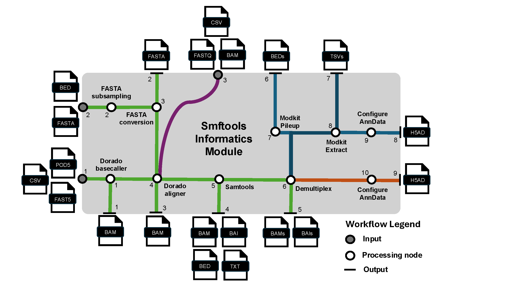
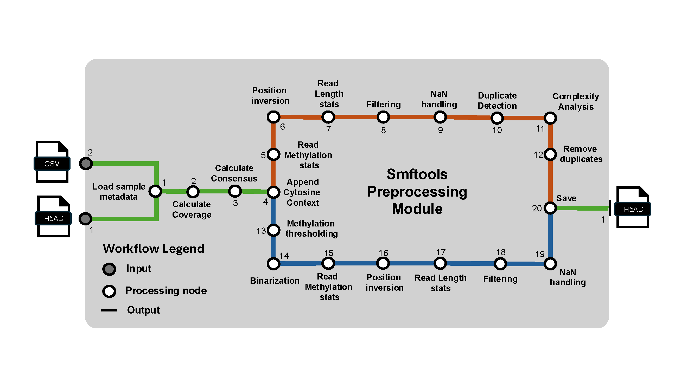

# smftools
A Python tool for processing raw sequencing data derived from single molecule footprinting experiments into [anndata](https://anndata.readthedocs.io/en/latest/) objects. Additional functionality for preprocessing, analysis, and visualization.

## Philosophy
While most genomic data structures handle low-coverage data (<100X) along large references, smftools prioritizes high-coverage data (scalable to >1,000,000X coverage) of a few genomic loci at a time. This enables efficient data storage, rapid data operations, hierarchical metadata handling, seamless integration with various machine-learning packages, and ease of visualization. Furthermore, functionality is modularized, enabling analysis sessions to be saved, reloaded, and easily shared with collaborators. Analyses are centered around the [anndata](https://anndata.readthedocs.io/en/latest/) object, and are heavily inspired by the work conducted within the single-cell genomics community.

## Dependencies
The following CLI tools need to be installed and configured before using the informatics (smftools.inform) module of smftools:
1) [Dorado](https://github.com/nanoporetech/dorado) -> For standard/modified basecalling and alignment. Can be attained by downloading and configuring nanopore MinKnow software.
2) [Samtools](https://github.com/samtools/samtools) -> For working with SAM/BAM files
3) [Minimap2](https://github.com/lh3/minimap2) -> The aligner used by Dorado
4) [Modkit](https://github.com/nanoporetech/modkit) -> Extracting summary statistics and read level methylation calls from modified BAM files
5) [Bedtools](https://github.com/arq5x/bedtools2) -> For generating Bedgraphs from BAM alignment files.
6) [BedGraphToBigWig](https://genome.ucsc.edu/goldenPath/help/bigWig.html) -> For converting BedGraphs to BigWig files for IGV sessions.

## Modules
### Informatics: Processes raw Nanopore/Illumina data from SMF experiments into an AnnData object.

### Preprocessing: Appends QC metrics to the AnnData object and performs filtering.

### Tools: Appends analyses to the AnnData object.
- Currently Includes: Position X Position correlation matrices, Hidden Markov Model feature detection, clustering, dimensionality reduction, peak calling, train/test workflows for various ML classifiers.
- To do: Additional ML methods for learning predictive single molecule features on condition labels: Autoencoders, Variational Autoencoders, Transformers.
### Plotting: Visualization of analyses stored within the AnnData object.
- Most analyses appended to the adata object by a tools method have, or will have, an accompanying plotting method.

## Announcements

### 05/29/25 - Version 0.1.6 is available through PyPI.
Informatics, preprocessing, tools, plotting modules have core functionality that is approaching stability on MacOS(Intel/Silicon) and Linux(Ubuntu). I will work on improving documentation/tutorials shortly. The base PyTorch/Scikit-Learn ML-infrastructure is going through some organizational changes to work with PyTorch Lightning, Hydra, and WanDB to facilitate organizational scaling, multi-device usage, and logging.

### 10/01/24 - More recent versions are being updated frequently. Installation from source over PyPI is recommended!

### 09/09/24 - The version 0.1.1 package ([smftools-0.1.1](https://pypi.org/project/smftools/)) is installable through pypi!
The informatics module has been bumped to alpha-phase status. This module can deal with POD5s and unaligned BAMS from nanopore conversion and direct SMF experiments, as well as FASTQs from Illumina conversion SMF experiments. Primary output from this module is an AnnData object containing all relevant SMF data, which is compatible with all downstream smftools modules. The other modules are still in pre-alpha phase. Preprocessing, Tools, and Plotting modules should be promoted to alpha-phase within the next month or so.

### 08/30/24 - The version 0.1.0 package ([smftools-0.1.0](https://pypi.org/project/smftools/)) is installable through pypi!
Currently, this package (smftools-0.1.0) is going through rapid improvement (dependency handling accross Linux and Mac OS, testing, documentation, debugging) and is still too early in development for widespread use. The underlying functionality was originally developed as a collection of scripts for single molecule footprinting (SMF) experiments in our lab, but is being packaged/developed to facilitate the expansion of SMF to any lab that is interested in performing these styles of experiments/analyses. The alpha-phase package is expected to be available within a couple months, so stay tuned!
