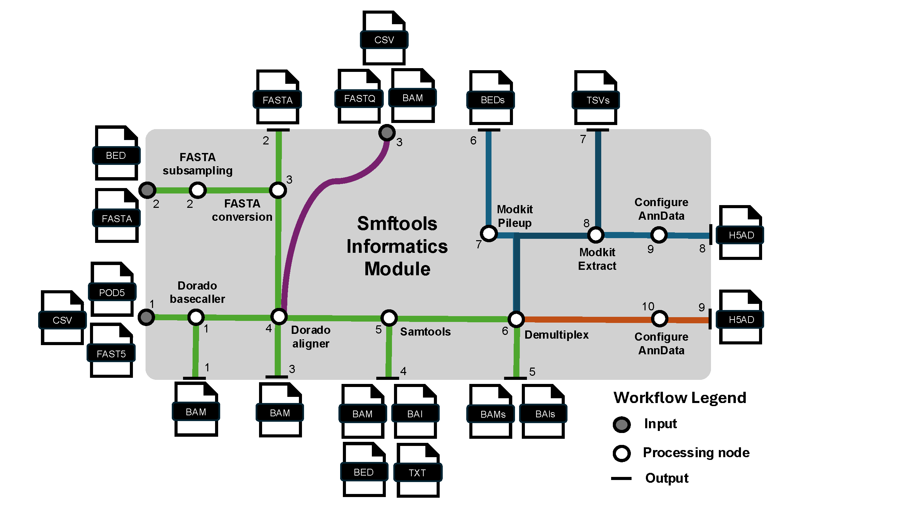
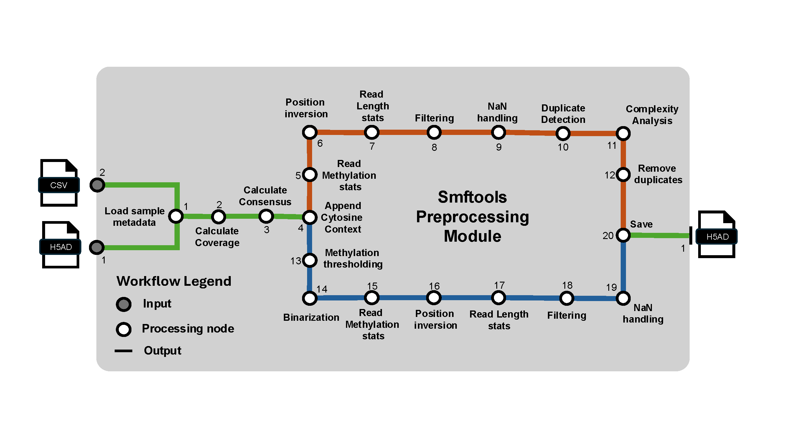

# Basic Usage

## Raw And Load Usage

Experiment-scoped commands (everything that takes a single experiment config) live under
`smftools experiment`. Project-scoped commands (everything that spans multiple registered
experiments) live under `smftools project`. Anything outside those two groups (e.g.
`subsample-pod5`) is a standalone utility with no experiment/project config of its own.

In v2, workflows begin by preparing BAM artifacts and the ragged per-read source of truth:

```shell
smftools experiment raw "/Path_to_experiment_config.csv"
```

Dense reference-grid data is materialized on demand. To persist the full dense zarr cache ahead of
downstream work, run the optional command:

```shell
smftools experiment load "/Path_to_experiment_config.csv"
```

This command takes a user passed config file handling:
    - I/O pathes (With data input path, FASTA path, optional BED path for subsampling FASTA, and a data output path)
    - Experiment info (SMF modality, sequencer type, barcoding kit if nanopore, sample sheet with metadata mapping)
    - Options to override default workflow parameters from smftools/config. Params are handled from default.yaml -> modality_type.yaml -> user passed config.csv.



For `smf_modality: deaminase` experiments, `raw` also derives per-read strand-switch metrics
(`ct_event_count`, `ga_event_count`, `strand_segment_purity`) from the alignment CIGAR and, unless
`bypass_raw_chimera_rate_plot` is set, writes a reference x barcode heatmap of the resulting
PCR-chimera rate to `raw_outputs/plots/reference_barcode_chimera_rate.png` (with a companion
`.csv` table) so you can spot problem barcodes before preprocessing.

## Preprocess Usage

This command performs preprocessing on the anndata object.

```shell
smftools experiment preprocess "/Path_to_experiment_config.csv"
```



Two read-level filters/labels run as part of this stage:

- **CIGAR-based internal indel filtering.** Reads whose longest internal insertion or deletion
  (from the alignment CIGAR) exceeds `max_internal_insertion_length` / `max_internal_deletion_length`
  (default 10bp each) are dropped. Set either to `null` to disable that check, or set
  `bypass_filter_reads_on_cigar_indels: True` to skip the step entirely.
- **Deaminase PCR-chimera labeling** (`smf_modality: deaminase` only). Reads whose deamination
  signature switches from a C->T span to a G->A span partway through the read (evidence of two
  templates fused during PCR) are flagged in `obs["deaminase_PCR_chimera"]` -- these reads are
  **labeled, not removed**, so you can filter or inspect them downstream. Sensitivity is controlled
  by `deaminase_chimera_min_events_per_span`, `deaminase_chimera_min_segment_purity`, and
  `deaminase_chimera_max_single_strand_fraction`; set `bypass_label_deaminase_pcr_chimeras: True`
  to skip.


## Variant Usage

This command performs DNA sequence variation based analyses on the anndata object.

```shell
smftools experiment variant "/Path_to_experiment_config.csv"
```

## Chimeric Usage

This command performs putative PCR chimera detection on the anndata object.

```shell
smftools experiment chimeric "/Path_to_experiment_config.csv"
```

## Spatial Usage

This command performs spatial analysis on preprocessed data.

```shell
smftools experiment spatial "/Path_to_experiment_config.csv"
```

When a partitioned preprocessing spine is available, spatial analysis automatically runs as
bounded reference/window/barcode tasks over QC-passing deduplicated reads. It writes a linked
spatial spine, barcode-stratified autocorrelation tables, position profiles, and registered plots.
Set `spatial_execution_mode` to `auto`, `partitioned`, or `legacy` to control selection.
Locus-mode references automatically receive full-reference clustermaps and position matrices per
reference strand. For genome-mode references, set `spatial_regions_bed` to a standard 0-based,
half-open BED file; dense products are then limited to those intervals. BED chromosome names may
be exact reference-strand names or native reference names that apply to both strands.

Partitioned spatial analysis also saves read-level ACF and direct-signal Lomb-Scargle results by
default. Each task directory in the general spatial `store` contains a `read_metrics.zarr` AnnData
partition. Per-read ACF, pair-count, and normalized periodogram arrays use `obsm`; peak period,
peak power, raw peak power, SNR, FWHM, site count, and scoring status use `obs`; lag and
frequency/period coordinates use `uns`. This matches preprocessing-store conventions without
expanding the thin spatial spine. Automated periodicity plots summarize peak-period and peak-power
distributions, scoring fraction, and barcode-mean spectra for each reference region and site type.
Per-reference-and-barcode read clustermaps show the individual ACF and Lomb-Scargle power profiles
with aligned mean curves above each heatmap.

The legacy dense path continues to provide whole-reference position correlation matrices,
clustermaps, and the existing AnnData-embedded spatial results.

## HMM Usage

This command performs hmm based feature annotation on the anndata object.

```shell
smftools experiment hmm "/Path_to_experiment_config.csv"
```

`hmm_execution_mode` accepts `auto`, `partitioned`, or `legacy`. The default `auto` mode uses a
partitioned spatial/preprocessing spine when available and writes bounded HMM task Zarr groups, a
task catalog, model store, plot catalog, and linked thin spine under `hmm_adata_outputs`.

- Main outputs wills be stored in adata.layers


## Latent Usage

This command constructs various latent representations of the anndata object.

```shell
smftools experiment latent "/Path_to_experiment_config.csv"
```

## Full Usage

This command runs the standard workflow in order: raw store creation, preprocessing, spatial
analysis, and HMM annotation. Each stage retains its normal restart/skip behavior, so an existing
valid stage output is reused unless its force-redo configuration is enabled.

```shell
smftools experiment full "/Path_to_experiment_config.csv"
```

## Batch Usage

This command performs batch processing of any of the above commands across multiple experiments. It takes in a tsv, txt, or csv of experiment specific config csvs.
```shell
smftools experiment batch preprocess "/Path_to_experiment_config_path_list.csv"
```

- Nice when analyzing multiple experiments

## Project Usage

A **project** is a lightweight cross-experiment registry: it never copies or merges data, it just
keeps pointers to experiment output directories (each containing a `spine.h5ad`) plus a table that
harmonizes reference names across experiments (by sequence identity, so the same locus can be
called different things in different experiments). Use it when you want to query or analyze
multiple experiments together without materializing one giant combined AnnData ahead of time. See
[Organizing data, experiments, and projects](tutorials/directory_organization.md) for a full
directory layout, a step-by-step experiment-to-project walkthrough, and how to move or share that
directory tree across machines.

```shell
# Create a project registry.
smftools project init "/Path_to_project_directory"

# Register an experiment by pointer (its output directory -- or one stage dir
# inside it, e.g. raw_outputs -- either works, every stage found is recorded).
smftools project add "/Path_to_project_directory" "/Path_to_experiment_output_dir"

# List registered experiments (with which stages each has reached) and harmonized references.
smftools project list "/Path_to_project_directory"

# Materialize one canonical reference across every matching experiment into a single AnnData.
smftools project materialize "/Path_to_project_directory" my_canonical_reference \
    -o "/Path_to_output.h5ad.gz"

# Mark an experiment inactive (soft delete; registry entries are append-only).
smftools project remove "/Path_to_project_directory" experiment_id
```

- `project add` discovers every pipeline stage spine under the given directory and reads the raw
  spine's `uns` metadata (modality, sequence-hash reference identities) to register it -- no
  matrices are opened.
- `project materialize` resolves the canonical reference name back to each matching experiment's
  own reference name(s), materializes each experiment's slice independently, and concatenates them
  with an added `obs["experiment"]` column -- there is never a global merge across experiments.
  Each experiment's spine is picked independently, defaulting to the most-derived stage available
  (`--stage` pins all experiments to one specific stage instead); `--read-metrics` additionally
  attaches spatial's per-read outputs where available.
- `smftools project export-fastq ...` (below) and other cross-experiment tooling build on the
  same registry.

## Export FASTQ Usage

This command writes one FASTQ (gzip-compressed by default) per barcode, containing only reads that
passed QC, for a single experiment or an entire project. Sequence and quality are read directly
from the raw ragged store, so no BAM re-parsing is needed. It's available under both hierarchies:

```shell
# Single experiment: QC-passed read set is resolved from the most complete preprocessing
# artifact available (partitioned preprocess spine, falling back to the legacy deduplicated
# or QC-filtered AnnData).
smftools experiment export-fastq "/Path_to_experiment_config.csv" --outdir "/Path_to_fastq_output_dir"

# Whole project: writes one FASTQ per <experiment_id>__<barcode>, skipping experiments that
# have not run partitioned preprocessing.
smftools project export-fastq "/Path_to_project_directory" --outdir "/Path_to_fastq_output_dir"
```

- `--group-by` overrides the obs column used to group reads (experiment command only; defaults to
  `sample_name_col_for_plotting`, falling back to `Sample` then `Barcode`).
- `--experiments` restricts the project command to a comma-separated list of experiment ids
  (default: all active).
- `--allow-unfiltered` writes every raw read instead of raising/skipping when no QC-passed read set
  is available yet (i.e. before `smftools experiment preprocess` has been run).
- `--no-gzip` writes plain `.fastq` instead of `.fastq.gz`.
- A `fastq_manifest.csv` (barcode, read count, output path) is written alongside the FASTQs.

## Concatenate Usage

This command concatenates multiple h5ad files and saves them to a new output. The h5ads to concatenate are provided as a txt, tsv, or h5ad file of paths.
```shell
smftools experiment concatenate "/Path_to_experiment_config.csv" -c "/Path_to_h5ad_path_list.csv"
```

Alternatively, you can just concatenate all h5ads within a given directory.
```shell
smftools experiment concatenate "/Path_to_experiment_config.csv" -d "/Path_to_h5ad_file_dir/"
```

- Mainly used for combining multiple experiments into a single anndata object.

## Subsample POD5 Usage

This command subsamples a POD5 file or a directory of POD5 files. It can be done by passing a txt file of read names to use, or an integer number of reads.
```shell
smftools subsample-pod5 -r "/Path_to_read_name_list.txt" -o "/Path_to_output_directory" "/Path_to_input_POD5_dir_or_file"
```

```shell
smftools subsample-pod5 -n 1000 -o "/Path_to_output_directory" "/Path_to_input_POD5_dir_or_file"
```

## Optional run logging

If you want to maintain run log files of CLI processes, you can use the following syntax to any of the CLI commands. Here is an example using `smftools experiment load` with logging performed on INFO level logging outputs and above.
```shell
smftools --log-file "/Path_to_output_log_file.log" --log-level INFO experiment load "/Path_to_input_config.csv"
```

## Reading AnnData objects created by smftools

After creating an AnnData object holding your experiment's SMF data, you can load the AnnData object as so:

```
import smftools as smf
input_adata = "/Path_to_experiment_AnnData.h5ad.gz"
adata = safe_read_h5ad(input_adata)
```

This custom read function will take an optional directory of pickle files for data types that can not normally be saved directly in hdf5 formatting that was saved with the safe_write_h5ad function.


If you don't have an AnnData object yet, but want to play with the downstream Preprocessing, Tools, and Plotting modules, you can load a pre-loaded SMF dataset.

Currently, you can do this with our lab's in vitro dCas9 binding kinetics dataset generated from a Hia5 SMF dataset generated with direct m6A high accuracy basecalls:

```
adata = smf.datasets.dCas9_kinetics()
adata.obs_names_make_unique()
```

Alternatively, you can do this with our lab's M.CviPI SMF test data in F1-hybrid natural killer cells generated by NEB EMseq conversion followed by canonical basecalling:

```
adata = smf.datasets.Kissiov_and_McKenna_2025()
adata.obs_names_make_unique()
```

## Writing out AnnData objects to save analysis progress

After preprocessing and downstream analysis of the AnnData object, you can save the AnnData object at any step as so:

```
import smftools as smf
from pathlib import Path

output_dir = Path('/Path_to_output_directory')
output_adata = 'analyzed_adata.h5ad.gz'
final_output_path = output_dir / output_adata
safe_write_h5ad(adata, final_output_path, compression='gzip')
```

This custom save function will make a directory of pickle files for data types that can not normally be saved directly in hdf5 formatting.

## Troubleshooting
For more advanced usage and help troubleshooting, the API and tutorials for each of the modules is still being developed.
However, you can currently learn about the functions contained within the module by calling:

```
smf.inform.__all__
```

This lists the functions within any given module. If you want to see the associated docstring for a given function, here is an example:

```
print(smf.inform.load_adata.__doc__)
```

These docstrings will provide a brief description of the function and also tell you the input parameters and what the function returns.
In some cases, usage examples will also be provided in the docstring in the form of doctests.
