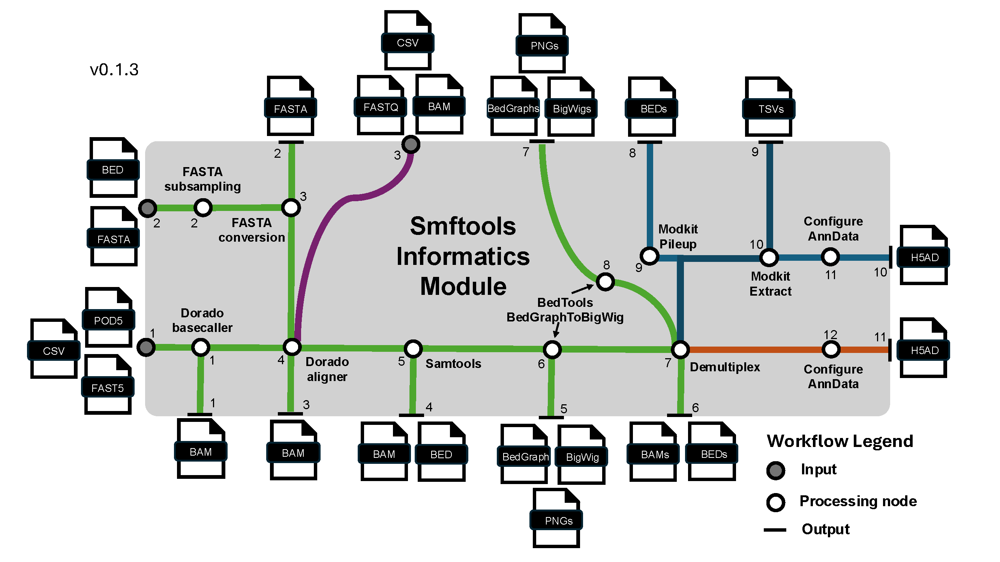

# Basic Usage

## Load Usage

Many use cases for smftools begin here. For most users, the call below will be sufficient to convert any raw SMF dataset from Nanopore/Illumina to an AnnData object:

```shell
smftools load "/Path_to_experiment_config.csv"
```

This command takes a user passed config file handling:
    - I/O pathes (With data input path, FASTA path, optional BED path for subsampling FASTA, and a data output path)
    - Experiment info (SMF modality, sequencer type, barcoding kit if nanopore, sample sheet with metadata mapping)
    - Options to override default workflow parameters from smftools/config. Params are handled from default.yaml -> modality_type.yaml -> user passed config.csv.



## Preprocess Usage

This command performs preprocessing on the anndata object.

```shell
smftools preprocess "/Path_to_experiment_config.csv"
```


## Variant Usage

This command performs DNA sequence variation based analyses on the anndata object.

```shell
smftools variant "/Path_to_experiment_config.csv"
```

## Chimeric Usage

This command performs putative PCR chimera detection on the anndata object.

```shell
smftools chimeric "/Path_to_experiment_config.csv"
```

## Spatial Usage

This command performs spatial analysis on the anndata object.

```shell
smftools spatial "/Path_to_experiment_config.csv"
```

- Currently Includes: Position X Position correlation matrices, read x position clustermaps, and spatial autocorrelation. 

## HMM Usage

This command performs hmm based feature annotation on the anndata object.

```shell
smftools hmm "/Path_to_experiment_config.csv"
```

- Main outputs wills be stored in adata.layers


## Latent Usage

This command constructs various latent representations of the anndata object.

```shell
smftools latent "/Path_to_experiment_config.csv"
```

## Full Usage

This command is a wrapper that sequentially runs load, preprocess, variant, chimeric, spatial, hmm, latent workflows.

```shell
smftools full "/Path_to_experiment_config.csv"
```

## Batch Usage

This command performs batch processing of any of the above commands across multiple experiments. It takes in a tsv, txt, or csv of experiment specific config csvs.
```shell
smftools batch preprocess "/Path_to_experiment_config_path_list.csv"
```

- Nice when analyzing multiple experiments

## Concatenate Usage

This command concatenates multiple h5ad files and saves them to a new output. The h5ads to concatenate are provided as a txt, tsv, or h5ad file of paths.
```shell
smftools concatenate output.h5ad -c "/Path_to_h5ad_path_list.csv"
```

Alternatively, you can just concatenate all h5ads within a given directory.
```shell
smftools concatenate output.h5ad -d "/Path_to_h5ad_file_dir/"
```

- Mainly used for combining multiple experiments into a single anndata object.

## Subsample POD5 Usage

This command subsamples a POD5 file or a directory of POD5 files. It can be done by passing a txt file of read names to use, or an integer number of reads.
```shell
smftools subsample-pod5 -r "/Path_to_read_name_list.txt" -o "/Path_to_output_directory" "/Path_to_input_POD5_dir_or_file"
```

```shell
smftools subsample-pod5 -n 1000 -o "/Path_to_output_directory" "/Path_to_input_POD5_dir_or_file"
```

## Optional run logging

If you want to maintain run log files of CLI processes, you can use the following syntax to any of the CLI commands. Here is an example using smftools load with logging performed on INFO level logging outputs and above.
```shell
smftools --log-file "/Path_to_output_log_file.log" --log-level INFO load "/Path_to_input_config.csv"
```

## Reading AnnData objects created by smftools

After creating an AnnData object holding your experiment's SMF data, you can load the AnnData object as so:

```
import smftools as smf
input_adata = "/Path_to_experiment_AnnData.h5ad.gz"
adata = safe_read_h5ad(input_adata)
```

This custom read function will take an optional directory of pickle files for data types that can not normally be saved directly in hdf5 formatting that was saved with the safe_write_h5ad function.


If you don't have an AnnData object yet, but want to play with the downstream Preprocessing, Tools, and Plotting modules, you can load a pre-loaded SMF dataset.

Currently, you can do this with our lab's in vitro dCas9 binding kinetics dataset generated from a Hia5 SMF dataset generated with direct m6A high accuracy basecalls:

```
adata = smf.datasets.dCas9_kinetics()
adata.obs_names_make_unique()
```

Alternatively, you can do this with our lab's M.CviPI SMF test data in F1-hybrid natural killer cells generated by NEB EMseq conversion followed by canonical basecalling:

```
adata = smf.datasets.Kissiov_and_McKenna_2025()
adata.obs_names_make_unique()
```

## Writing out AnnData objects to save analysis progress

After preprocessing and downstream analysis of the AnnData object, you can save the AnnData object at any step as so:

```
import smftools as smf
from pathlib import Path

output_dir = Path('/Path_to_output_directory')
output_adata = 'analyzed_adata.h5ad.gz'
final_output_path = output_dir / output_adata
safe_write_h5ad(adata, final_output_path, compression='gzip')
```

This custom save function will make a directory of pickle files for data types that can not normally be saved directly in hdf5 formatting.

## Troubleshooting
For more advanced usage and help troubleshooting, the API and tutorials for each of the modules is still being developed.
However, you can currently learn about the functions contained within the module by calling:

```
smf.inform.__all__
```

This lists the functions within any given module. If you want to see the associated docstring for a given function, here is an example:

```
print(smf.inform.load_adata.__doc__)
```

These docstrings will provide a brief description of the function and also tell you the input parameters and what the function returns.
In some cases, usage examples will also be provided in the docstring in the form of doctests.